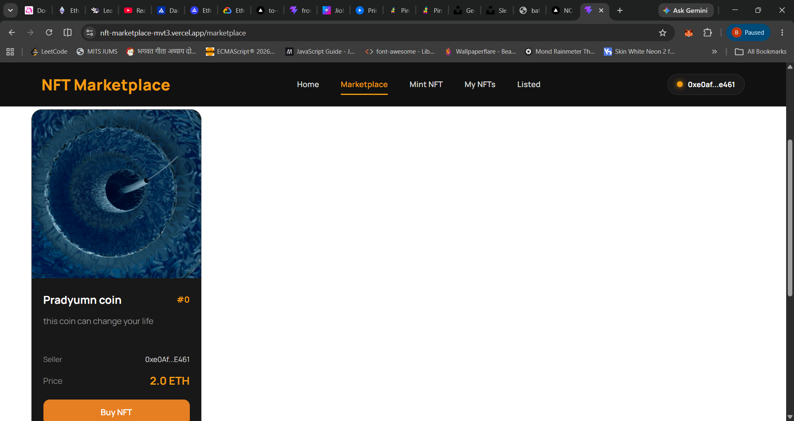

# 🚀 NFT Marketplace DApp

A fully decentralized NFT Marketplace built on the **Ethereum Sepolia Testnet** where users can mint, list, buy, and manage ERC-721 NFTs. The application integrates **Solidity smart contracts**, **React**, **Ethers.js**, **IPFS**, and **MetaMask** to provide a complete end-to-end Web3 experience.

> **Live Demo:** https://nft-marketplace-mvt3.vercel.app/

---

# 📖 Overview

This project demonstrates the complete workflow of an NFT marketplace, starting from minting NFTs to trading them securely on-chain.

NFT metadata is stored on **IPFS**, ownership is managed through the **ERC-721 standard**, and every marketplace transaction is executed through Ethereum smart contracts.

The project was built to gain practical experience with full-stack Web3 development and smart contract interactions.

---

# ✨ Features

### 🔐 Wallet Integration

* Connect using MetaMask
* Automatic wallet reconnection
* Ethereum Sepolia support

### 🎨 NFT Minting

* Mint ERC-721 NFTs
* Metadata stored on IPFS
* Image, name, and description fetched dynamically

### 🛒 Marketplace

* List NFTs for sale
* Buy NFTs securely
* Cancel active listings
* Display active marketplace listings

### 👤 User Dashboard

* View owned NFTs
* View listed NFTs
* Manage NFTs directly from the interface

### 💻 Modern Frontend

* Responsive design
* Clean UI
* Dynamic blockchain data
* React Context API for blockchain state management

---

# 🛠 Tech Stack

### Blockchain

* Solidity
* OpenZeppelin ERC-721
* Hardhat 3
* Ethereum Sepolia Testnet

### Frontend

* React.js
* React Router
* Context API
* CSS3

### Web3

* Ethers.js v6
* MetaMask
* IPFS (Pinata)

### Deployment

* Vercel

---

# 📂 Project Structure

```text
NFT-MARKETPLACE
│
├── contracts/
│   ├── MyNFT.sol
│   └── NFTMarketplace.sol
│
├── scripts/
│   └── deploy.js
│
├── frontend/
│   ├── src/
│   │   ├── components/
│   │   ├── context/
│   │   ├── pages/
│   │   ├── styles/
│   │   └── contract/
│   │
│   ├── public/
│   └── package.json
│
├── hardhat.config.ts
└── README.md
```

---

# ⚙️ Smart Contracts

## MyNFT.sol

Implements the ERC-721 NFT standard using OpenZeppelin.

### Responsibilities

* Mint NFTs
* Store Token URI
* Manage ownership
* Handle approvals

---

## NFTMarketplace.sol

Handles all marketplace functionality.

### Responsibilities

* List NFTs
* Purchase NFTs
* Cancel Listings
* Track active marketplace listings

---

# 🔄 DApp Workflow

```text
Upload Image
        │
        ▼
      IPFS
        │
        ▼
Create Metadata JSON
        │
        ▼
      IPFS
        │
        ▼
Mint NFT
        │
        ▼
Approve Marketplace
        │
        ▼
List NFT
        │
        ▼
Marketplace
        │
        ▼
Buy NFT
        │
        ▼
Ownership Transferred
```

---

# 🖥 Installation

Clone the repository

```bash
git clone https://github.com/pranshu1899/NFT-MARKETPLACE.git
```

Move into the project

```bash
cd NFT-MARKETPLACE
```

Install backend dependencies

```bash
npm install
```

Install frontend dependencies

```bash
cd frontend
npm install
```

---

# Environment Variables

Create a `.env` file in the project root.

```env
SEPOLIA_RPC_URL=YOUR_RPC_URL

SEPOLIA_PRIVATE_KEY=YOUR_PRIVATE_KEY
```

---

# Deploy Smart Contracts

Compile contracts

```bash
npx hardhat compile
```

Deploy

```bash
npx hardhat run scripts/deploy.js --network sepolia
```

After deployment,

* Copy contract addresses
* Update `BlockchainContext.jsx`
* Copy latest ABI files into:

```text
frontend/src/contract/
```

---

# Run Frontend

```bash
cd frontend

npm install

npm run dev
```

---

# Build

```bash
npm run build
```

---

# Screenshots

### Home Page

> Add screenshot here

---

### Marketplace



---

### Mint NFT

> Add screenshot here

---

### My NFTs

> Add screenshot here

---

# What I Learned

During this project I gained hands-on experience with:

* ERC-721 NFT Standard
* OpenZeppelin Contracts
* Smart Contract Development
* Marketplace Smart Contract Architecture
* NFT Ownership & Approvals
* IPFS Metadata Storage
* MetaMask Integration
* Ethers.js v6
* Hardhat 3
* React Context API
* Smart Contract Deployment
* Ethereum Sepolia Testnet
* Full Stack Web3 Development

---

# Future Improvements

* NFT Search
* Filters & Sorting
* Event-based data fetching
* Transaction history
* User Profiles
* Auction functionality
* Offer System
* Royalties (ERC-2981)
* Dark/Light Theme
* Loading animations
* Toast notifications
* Unit & Integration Tests

---

# Challenges Faced

* Understanding ERC-721 ownership and approvals
* Managing smart contract interactions with Ethers.js v6
* Handling asynchronous blockchain transactions
* Fetching decentralized metadata from IPFS
* Synchronizing frontend state with blockchain data
* Deploying contracts to Ethereum Sepolia
* Debugging Linux case-sensitive imports during deployment
* Managing contract addresses and ABI synchronization

---

# Author

**Pranshu Samadhiya**

GitHub

https://github.com/pranshu1899

LinkedIn

https://www.linkedin.com/in/pranshu-samadhiya-415052380/

---

# License

This project is licensed under the MIT License.

---

⭐ If you found this project interesting, consider giving it a star on GitHub!
